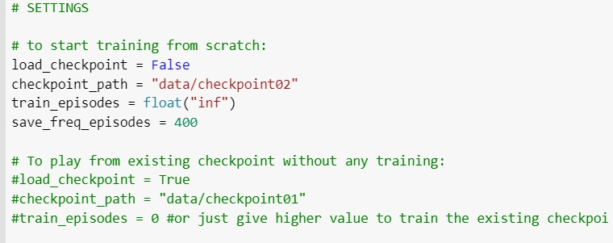
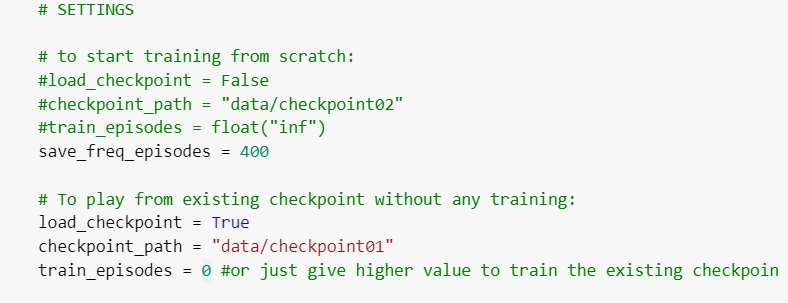
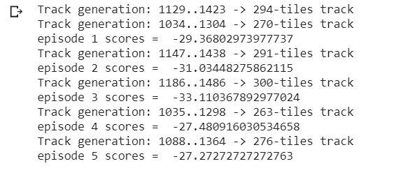
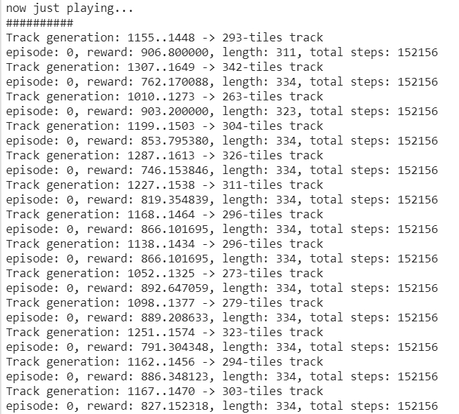

使用DQL訓練OPEN_AI_GYM CARRACING_V0
===================================

使用COLAB環境執行程式
--------------------

程式為jnbn檔,使用colab即可執行

先前失敗原因:
------------

Carracing 這個遊戲的action為連續動作[方向為(-1 ~ 1),油門為(0 ~ 1),煞車為(0 ~ 1)]連續動作使用sarsa模型訓練需要先將動作離散化,但這會消耗大量的效能以及影響準確度。

改進方法: 
--------

使用DQL 模型進行訓練。

程式執行步驟:
------------

1.導入BOX.2D套件

2.導入相關函式庫

3.導入Video 相關套件

4.宣告ExperienceHistory

5.宣告Agent

6.宣告test_experienceHistory

7.執行Main主程式

主程式說明 (程式有分為兩個部分)
------------------------------

1.重新訓練

load_checkpoint代表是否載入過去訓練資料。 checkpoint_path為此次訓練資料之名稱與路徑資料夾(data)。 輸出結果: 第一階段:會先開始訓練,按Enter鍵可以結束訓練並進入第二階段。 第二階段:會開始玩遊戲,並持續輸出每次玩的結果,按下Enter鍵結束。

2.採用過去訓練資料

checkpoint_path 是將訓練資料放入data資料夾內再colab上的話需要再content內自創data資料夾,並將訓練資料的資料夾放入。 train_episodes是選擇要不要接續訓練,這裡為0所以輸出會自動跳過訓練階段,並直接顯示第二階段玩遊戲的結果。

結果評估
--------

使用隨機策略玩5回合的結果為:

使用DQL模型的遊戲結果:

績效得到明顯提升並接近最終目標reward = 900分。

目前困難
--------

還再想辦法解決將video套入模型中出錯的問題,解決後將可以看到實際上車子運行的影像。

附註
----

主程式Main每執行一次都要整個程式reset重跑

